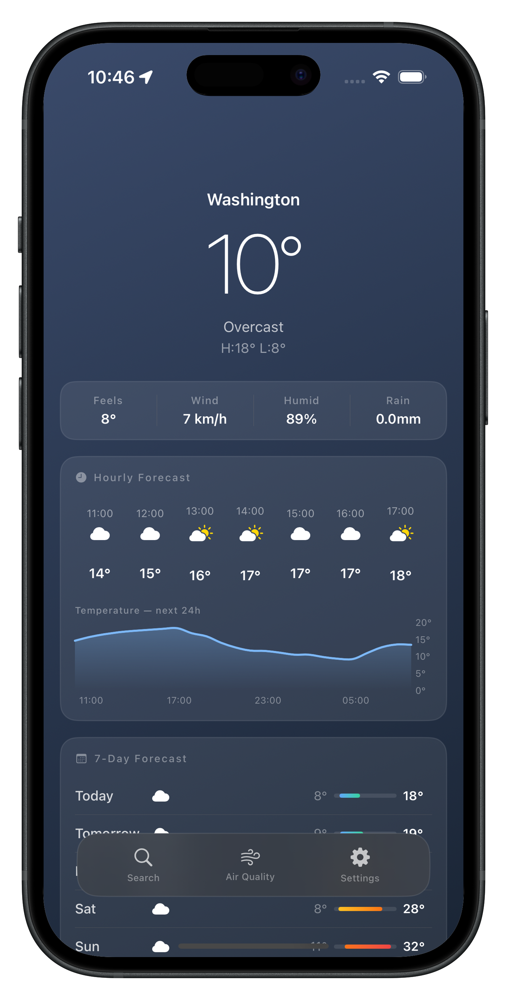
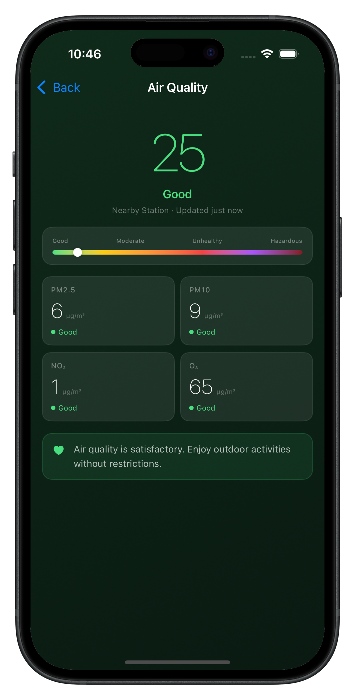
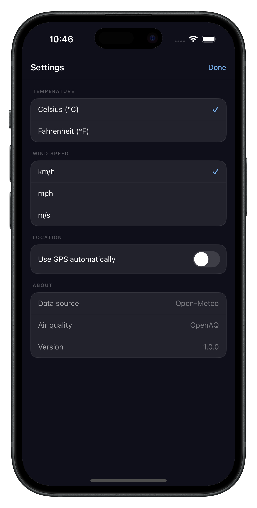
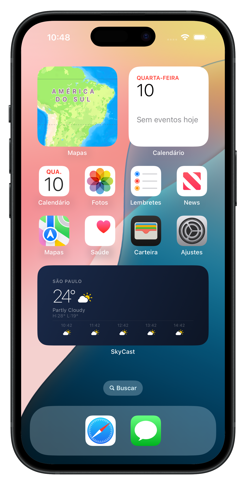
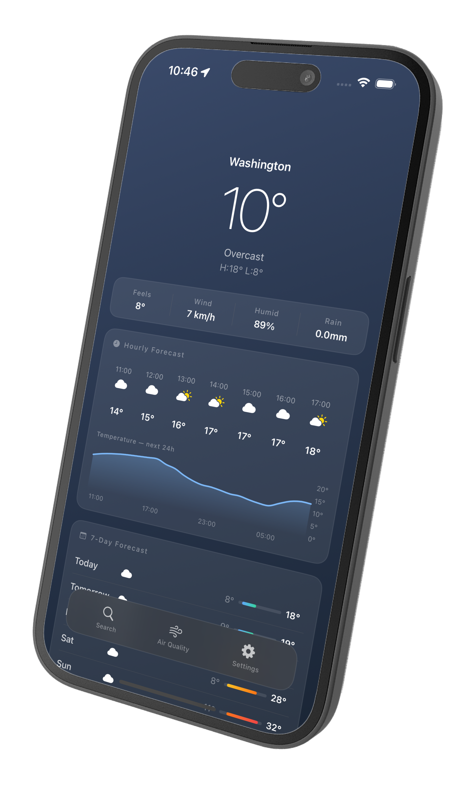

# SkyCast


A native iOS weather app built with **zero third-party dependencies**. SkyCast demonstrates production-grade REST API consumption, clean architecture, on-device data processing, and native Apple frameworks — all written in modern Swift.

---

## Screenshots

<p align="center">
  
  
  
  
  
</p>

---

## Features

- **Current conditions** — temperature, feels like, wind speed, humidity, precipitation
- **24-hour forecast** — scrollable hourly strip with Swift Charts temperature graph
- **7-day forecast** — daily min/max with color-coded temperature range bars
- **Air quality** — AQI score with PM2.5, PM10, NO₂ and O₃ using EPA formula
- **City search** — CLGeocoder with 400ms debounce, recent searches persisted locally
- **Home screen widget** — Small and Medium sizes with real-time data via WidgetKit
- **Unit preferences** — Celsius/Fahrenheit, km/h / mph / m/s, persisted across sessions

---

## Architecture

SkyCast follows **MVVM + Repository Pattern** with strict layer separation:

```
SkyCast/
├── Core/
│   ├── Network/          # HTTPClient protocol + URLSession implementation
│   ├── Location/         # CLLocationManager wrapped in async/await
│   └── Extensions/       # Date formatting, Color utilities
├── Features/
│   ├── Weather/
│   │   ├── Data/         # WeatherRepository + DTOs + Codable mapping
│   │   ├── Domain/       # WeatherModel + WeatherCondition + WeatherMapper
│   │   └── Presentation/ # HomeViewModel (@Observable) + SwiftUI Views
│   ├── AirQuality/       # Same layered structure as Weather
│   ├── Search/           # CLGeocoder with debounce, UserDefaults persistence
│   └── Settings/         # Unit preferences with didSet auto-persistence
├── Widget/               # WidgetKit TimelineProvider + Small/Medium views
└── Tests/                # URLProtocol mocks, Repository tests, Mapper tests
```

**State management:** `@Observable` macro (iOS 17) — no Combine, no third-party reactive frameworks.

**Concurrency:** Swift async/await throughout. The `CLLocationManager` delegate is bridged to async/await via `withCheckedThrowingContinuation`, keeping the codebase consistent.

---

## APIs

| Service | Endpoint | Auth |
|---|---|---|
| Open-Meteo Weather | `api.open-meteo.com/v1/forecast` | None |
| Open-Meteo Air Quality | `air-quality-api.open-meteo.com/v1/air-quality` | None |

Both APIs are free with no API key required — the app works out of the box with no configuration.

---

## Technical Decisions

### No third-party networking libraries
`URLSession` with `async/await` handles all HTTP requests. A custom `URLBuilder` constructs URLs safely using `URLComponents`, avoiding string concatenation. This keeps the dependency graph flat and demonstrates native API mastery.

### Protocol-driven architecture for testability
Every external dependency (`HTTPClient`, `WeatherRepository`, `AQRepository`, `LocationService`) is defined as a protocol. Tests inject mock implementations without touching real network or GPS — no flaky async tests.

### URLProtocol mocking
`MockURLProtocol` intercepts `URLSession` requests at the transport layer. This means `WeatherRepositoryImpl` is tested against real JSON decoding logic with zero network calls — the same technique used in production iOS codebases.

### AQI calculation using EPA formula
Air Quality Index is computed from raw PM2.5 and PM10 concentrations using the official EPA linear interpolation formula — not a simplified approximation. Each pollutant has its own breakpoint table matching US AQI standards.

### Debounce without Combine
`SearchViewModel` implements 400ms debounce using `Task.sleep` and `Task.isCancelled` — no Combine, no third-party libraries. Clean, readable, and testable.

### App Group for Widget data sharing
The selected city is persisted to a shared `UserDefaults` suite (`group.com.donidevrs.skycast`) accessible by both the main app and the Widget extension — the standard approach for WidgetKit data sharing.

---

## Testing

```
SkyCastTests/
├── WeatherMapperTests     # WMO weather code mapping, DTO → domain model
├── WeatherRepositoryTests # URL construction, JSON decoding, error propagation
└── AQRepositoryTests      # Open-Meteo AQ API integration, AQMapper, AQI formula
```

All tests use `MockURLProtocol` to intercept `URLSession` — no real network calls in CI.

Run tests locally:
```bash
xcodebuild test \
  -scheme SkyCastTests \
  -destination 'platform=iOS Simulator,name=iPhone 16,OS=latest'
```

---

## Requirements

- Xcode 16+
- iOS 17+
- No API keys or configuration needed

## Getting Started

```bash
git clone https://github.com/DoniDevRs/SkyCast.git
cd SkyCast
open SkyCast.xcodeproj
```

Build and run on any iOS 17+ simulator. Location permission is requested on first launch — alternatively, use the Search tab to select any city manually.

---

## CI/CD

GitHub Actions runs on every push to `main` and every pull request:

- Builds the `SkyCast` scheme on `macos-15` with Xcode 16
- Runs all unit tests against iPhone 16 simulator
- No code signing required in CI

---

## Skills Demonstrated

`SwiftUI` `Swift Concurrency` `URLSession` `Codable` `Swift Charts` `WidgetKit` `CoreLocation` `UserDefaults` `MVVM` `Repository Pattern` `Unit Testing` `URLProtocol Mocking` `GitHub Actions` `App Groups`

---

## Author

**Doni Ramos** — iOS Developer
[GitHub](https://github.com/DoniDevRs) · [LinkedIn](https://www.linkedin.com/in/doniramos)

